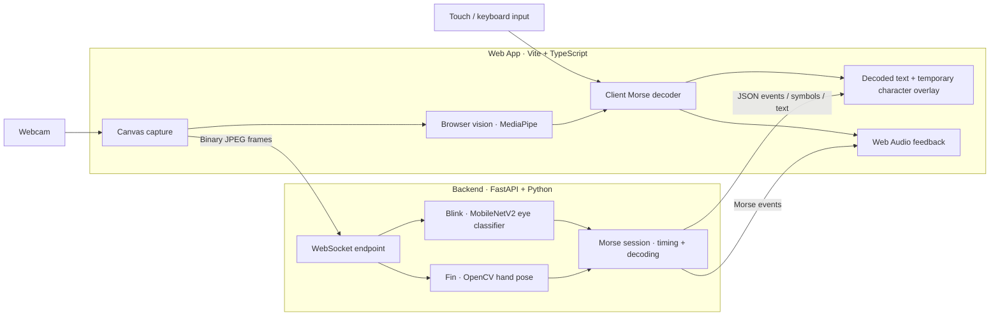

# Act2Morse

> **Real-time Assistive Communication Platform for Non-Verbal, Deaf-Mute, and Motor-Impaired Individuals**  
> _Transforming Micro Physical Actions into Living Words via Morse Code_

---

## 🌟 Mission & Overview

Communication is a fundamental human right. However, millions of people worldwide living with **mutism, deafness, ALS (Amyotrophic Lateral Sclerosis), locked-in syndrome, cerebral palsy, or severe motor disabilities** face immense challenges in expressing their daily thoughts, needs, and feelings to the world.

**Act2Morse** was created as an open, accessible, privacy-first assistive platform that bridges this gap. By utilizing standard webcams and modern computer vision, Act2Morse translates minimal physical gestures into **International Morse Code**, which is then automatically decoded in real time into clear alphanumeric text and natural audio:

1. **Blink2Morse (Ocular Mode)**: For non-verbal individuals with limited or no limb mobility. Micro eye blinks are captured via webcam and classified into Morse dots and dashes.
2. **Fin2Morse (Tactile / Fine-Motor Mode)**: For deaf, mute, or motor-impaired individuals who retain partial finger dexterity. Subtle taps or assistive switch presses are translated into Morse sequences.

---

## ✨ Key Features

- **Hands-Free Eye Tracking (Blink2Morse)**:
  - Powered by **`MichalMlodawski/open-closed-eye-classification-mobilev2`** running at 25–30 FPS for high-precision eye open/closed classification, assisted by face landmark tracking.
  - Adaptive thresholding distinguishing natural involuntary blinks from intentional Morse signals.
  - **Dot (`•`)**: Short deliberate blink (80ms – 600ms).
  - **Dash (`—`)**: Long deliberate closure (> 600ms).
  - **Automatic Letter Gap**: Pausing with eyes open for ~1.2s automatically finishes the current letter.
  - **Automatic Word Space**: Pausing with eyes open for ~2.5s inserts a word boundary space.

- **Hand & Finger Micro-Tap Tracking (Fin2Morse)**:
  - Powered by **`opencv/handpose_estimation_mediapipe`** tracking 21 3D hand keypoints in real time.
  - Detects thumb-to-index micro-pinch / tactile switch presses and translates them into Morse dots and dashes.
  - Press duration timing: quick tap (< 380ms) for Dot, sustained press (> 380ms) for Dash.

- **Dual-Engine Architecture (Cloud/Server AI + Local Fallback)**:
  - **AI Backend Mode**: Streams video frames over a low-latency WebSocket to a Python FastAPI backend running `MichalMlodawski/open-closed-eye-classification-mobilev2` (Blink mode) and `opencv/handpose_estimation_mediapipe` (Fin mode).
  - **Client-Side Vision Fallback**: If the server is offline, in-browser computer vision monitors eyes and hand gestures locally without requiring an active server connection.

- **Auditory & Visual Feedback**:
  - Web Audio API tone synthesizer providing distinct acoustic beeps for dots (high pitch), dashes, and character completion.
  - Live Retinal & Hand HUD with real-time metrics, targeting reticle, skeletal bones (white), joints (cyan), and status indicators.

- **Interactive Side Morse Chart**:
  - Full international alphanumeric reference chart (A–Z, 0–9) placed directly beside the live camera feed for immediate practice and reference.
  - Tap any symbol card to hear its acoustic Morse sequence.

- **100% Privacy-Preserving**:
  - Processing happens strictly on-device or across your private local network. Video feeds are analyzed in-memory and discarded frame-by-frame; no footage or biometric data is ever stored or transmitted to external third parties.

---

## 🏗️ Architecture



---

## Installation with Docker

### Requirements

- Docker installed with its daemon running (Docker Desktop or Docker Engine).
- Git and Bash (on Windows, use WSL).
- A browser and a webcam for gesture tracking. Manual Morse input also works without a webcam.
- Internet access for the first image build and AI model download.

### Start the application

```bash
git clone https://github.com/rcryan-hniht/Act2Morse.git
cd Act2Morse
./start.sh
```

The script builds the Docker image and runs both frontend and backend. You do
not need to install Node.js, Python, pnpm, or uv on the host.

Open **http://localhost:5173** in your browser. The backend health endpoint is
**http://localhost:8000/health**, and its WebSocket endpoint is
**ws://localhost:8000/ws**. Ports 5173 and 8000 must be available.

On first startup, the backend downloads its AI models. Wait for
`Application startup complete` in the terminal before starting camera tracking.
Models are cached in the `act2morse-models` Docker volume and reused on later runs.

Press **Ctrl+C** in the terminal to stop and remove the container. Run
`./start.sh` again to restart; cached image layers and models are reused.

The script binds both ports to localhost. Use the browser on the same computer;
access from a phone or another computer requires a separate network and HTTPS setup.

## How to use Act2Morse

1. Close the introduction dialog or select **Bắt đầu trải nghiệm**.
2. Choose **Fin2Morse** (finger/touch input) or **Blink2Morse** (eye tracking, beta).
3. For camera tracking, click **Launch Camera**, grant browser camera permission,
   and position your hand or face in the webcam frame. Wait for the vision model to load.
4. In **Fin2Morse**, hold **Spacebar** to input Morse: release before 380 ms
   for a dot (`•`), or hold longer for a dash (`—`). With the camera off,
   you can also touch/click and hold the webcam area. Keyboard **D** and **F**
   enter a dot and dash respectively.
5. With camera tracking, hold a closed fist for at least **600 ms** to add a word
   space; point your right thumb left to delete. In **Blink2Morse**, deliberate
   short eye closures create dots and longer closures create dashes.
6. Pause to finish a letter automatically. Each completed character appears at
   the center of the webcam for about **1 second**, then disappears.
7. The decoded sentence stays below the gesture status inside the webcam.
   Click **↑** to finish the current letter and copy the decoded text.
8. Tap a character in **Morse Reference Chart** to hear its Morse sequence.
   Open **Docs** for gesture instructions.

---

## 🎛️ Configuration & Tuning

Backend detection parameters can be customized via environment variables:

| Variable          | Default | Description                                                      |
| :---------------- | :------ | :--------------------------------------------------------------- |
| `CLOSE_THRESHOLD` | `0.5`   | Blendshape closure score to trigger eye-closed state (0.0 – 1.0) |
| `OPEN_THRESHOLD`  | `0.25`  | Blendshape score to trigger eye-open state (hysteresis gap)      |
| `MIN_BLINK_MS`    | `80`    | Minimum blink duration in milliseconds (filters micro-glitches)  |
| `DOT_MAX_MS`      | `380`   | Maximum duration for a Dot; closures exceeding this are Dashes   |
| `LETTER_GAP_MS`   | `2200`  | Open-eye pause duration to finalize a character                  |
| `WORD_GAP_MS`     | `5000`  | Open-eye pause duration to insert a word space                   |

---

## 📜 International Morse Code Reference

| Char  | Morse  | Char  | Morse  | Char  | Morse  | Digit | Morse   |
| :---: | :----- | :---: | :----- | :---: | :----- | :---: | :------ |
| **A** | `.-`   | **J** | `.---` | **S** | `...`  | **1** | `.----` |
| **B** | `-...` | **K** | `-.-`  | **T** | `-`    | **2** | `..---` |
| **C** | `-.-.` | **L** | `.-..` | **U** | `..-`  | **3** | `...--` |
| **D** | `-..`  | **M** | `--`   | **V** | `...-` | **4** | `....-` |
| **E** | `.`    | **N** | `-.`   | **W** | `.--`  | **5** | `.....` |
| **F** | `..-.` | **O** | `---`  | **X** | `-..-` | **6** | `-....` |
| **G** | `--.`  | **P** | `.--.` | **Y** | `-.--` | **7** | `--...` |
| **H** | `....` | **Q** | `--.-` | **Z** | `--..` | **8** | `---..` |
| **I** | `..`   | **R** | `.-.`  |       |        | **9** | `----.` |
|       |        |       |        |       |        | **0** | `-----` |

---

## 🤝 Open Source & Accessibility

Act2Morse is built with the belief that open technology can tear down barriers to human connection. If you are an accessibility researcher, occupational therapist, or software engineer interested in contributing, pull requests and issues are warmly welcomed.
